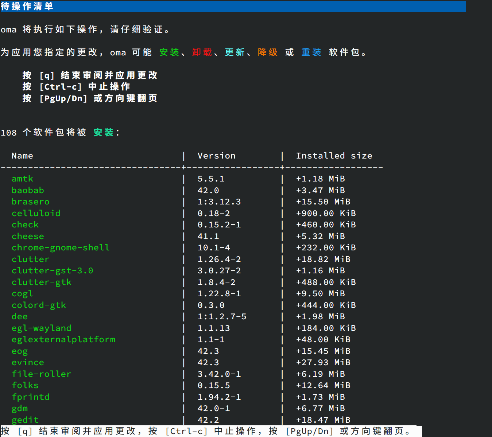

# oma - Oh My Ailurus 🐼
**Package Manager for AOSC OS**

`oma` (**Oh My Ailurus**) is a sleek, modern package management interface designed for AOSC OS. Built on top of `libapt-pkg`, `oma` brings enhanced usability and smart features to elevate your package management experience.

The goal of this project is to make apt with better user interaction (especially for AOSC OS users). Above apt we made a lot of features to enhance its usability, efficiency, and overall user experience.

### Also available for other dpkg-based OS!
See [Build and Install](#-build-and-install)

---

## 🌟 Features

### 🚀 Pending Operations
Preview and manage upcoming changes with an intuitive interface.


---

### 🌐 Multi-threaded Downloads
Experience faster downloads with built-in multi-threading.

[Multi-threaded Downloads](https://github.com/AOSC-Dev/oma/assets/19554922/e857a946-b6c5-4c22-8d56-398b2ce0a624)

---

### 🔍 Smart Search
Search with precision and speed using context-aware smart search.

[Smart Search](https://github.com/AOSC-Dev/oma/assets/19554922/eed6d992-6464-48eb-8b4f-075ea378bd0c)

---

### ⏪ Undo Changes Effortlessly
Accidentally made changes? Roll back operations with a single command.

[Undo Feature](https://github.com/AOSC-Dev/oma/assets/19554922/f971313b-15bd-4a8e-9b33-aa5c4645e46b)


---

## 🛠️ Dependencies

To build and use `oma`, ensure the following dependencies are installed:

- `libapt-pkg`
- `glibc`
- `ripgrep` (optional, accelerates `oma provides`, `oma files`, and `oma command-not-found`)
- `LLVM/Clang`
- `OpenSSL`
- `Rustc` with `Cargo`
- `nettle`
- `pkg-config`

---

## 📦 Build and Install

`Oma` now available for AOSC OS, Debian, Ubuntu, Deepin and more dpkg-based OS.

### Script Installation
```bash
curl -sSf https://repo.aosc.io/get-oma.sh | sudo sh
```

### Manually Installation

1. Clone the repository:
   ```bash
   git clone https://github.com/AOSC-Dev/oma.git
   cd oma
   ```

2. Build the binary:
   ```bash
   cargo build --release
   ```

3. Install the binary:
   ```bash
   sudo cp ./target/release/oma /usr/local/bin/oma
   ```

---

## 📖 Usage

### Enter interavtive package manager:
```bash
oma # without arguments
```

### Example Commands:
- Install a package:
  ```bash
  oma install <package_name>
  ```
- Search for a package:
  ```bash
  oma search <keyword>
  ```
- Remove a package:
  ```bash
  oma remove <package_name>
  ```
- Refresh repository metadata:
  ```bash
  oma refresh
  ```

For a full list of commands, run:

```bash
oma help
```

---

## #>? Full Command Reference

| Command       | Description                                                  |
|---------------|--------------------------------------------------------------|
| `install`     | Install package(s) from the repository                       |
| `upgrade`     | Upgrade all installed packages                               |
| `download`    | Download package(s) without installing                       |
| `remove`      | Remove specified package(s)                                  |
| `refresh`     | Refresh repository metadata                                  |
| `search`      | Search for package(s) in the repository                      |
| `show`        | Show detailed information for a package                      |
| `files`       | List files in the specified package                          |
| `provides`    | Find packages providing specific patterns                    |
| `fix-broken`  | Fix broken dependencies                                      |
| `pick`        | Install a specific version of package(s)                     |
| `mark`        | Mark package(s) with a specific status                       |
| `list`        | List all available packages                                  |
| `depends`     | Show dependencies for package(s)                             |
| `rdepends`    | Show reverse dependencies for package(s)                     |
| `clean`       | Clear downloaded package cache                               |
| `history`     | Show package history or change logs                          |
| `help`        | Show help of oma or the given subcommand(s)                  |

---

## 🤝 Contributing

**Contributions are welcome!**

Please feel free to submit issues or pull requests to help make `oma` even better.

**Please see [CONTRIBUTING](./CONTRIBUTING.md) for more details.**

---

## 📜 License

`oma` is licensed under the GNU General Public License v3.0. See the [COPYING](./COPYING) file for details.
